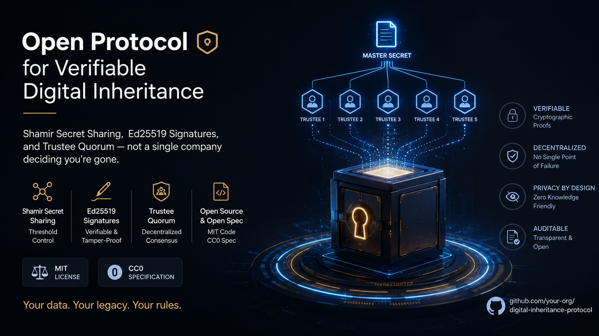

<div align="center">
  
</div>

# Digital Legacy Protocol (DLP)

[](https://github.com/Ciprian-LocalPulse/digital-legacy-protocol/actions/workflows/ci.yml)
[](LICENSE)
[](spec/SPEC.md)
[](pyproject.toml)

**An open protocol for what happens to your digital life after you're gone — verified by people you trust, not by a company's support ticket queue.**

Billions of dollars in cryptocurrency are permanently lost because private keys died with their owners. Families spend months fighting platform support to close a deceased parent's account. Every service — banks, exchanges, email providers, password managers — has invented its own incompatible, usually nonexistent policy for this. DLP is a small attempt to fix that with a standard instead of a company.

There is no server to sign up for, no token, no subscription. It's a spec plus a reference implementation. Fork it, embed it, ignore it.

## The idea in one paragraph

You write a signed manifest: *"if I disappear, give my daughter access to this wallet, delete this account, deliver this message."* The actual secrets (private keys, passwords) are never stored anywhere whole — they're split with Shamir's Secret Sharing among people you nominate as trustees, so no single trustee, platform, or attacker can act alone. If you stop checking in for long enough, your trustees are asked one question each: *"is Stefano actually gone, or did he just forget?"* Only when enough of them agree does anything get released — and any one of them can call it off if you're just on a boat with no signal.

## Why this doesn't already exist

It's not a hard cryptography problem — Shamir's Secret Sharing is decades old, Ed25519 signing is a solved problem. It's a coordination problem: no platform wants to build "what if the user dies" because it's grim, unprofitable, and nobody else supports it either, so there's nothing to be compatible *with*. DLP tries to be the thing everyone can be compatible with, released as public domain so no one has a reason not to adopt it.

## Quick start

```bash
pip install -e .
dlp demo
```

That runs a full scenario end to end: generates keys for an owner and three trustees, builds and signs a 2-of-3 manifest, splits a demo secret, simulates 200 days passing with no check-in, gathers two trustee attestations, reconstructs the secret, and hands it to a demo platform adapter. Nothing touches the network — it's all local, so you can read `dlp/cli.py`'s `cmd_demo` function alongside the output and see exactly what happened at each step.

## Using it as a library

```python
from dlp import ManifestBuilder, crypto, shamir

# Generate keys for the owner and three trustees
owner_priv, owner_pub = crypto.generate_keypair()
t1_priv, t1_pub = crypto.generate_keypair()
t2_priv, t2_pub = crypto.generate_keypair()
t3_priv, t3_pub = crypto.generate_keypair()

# Build a 2-of-3 manifest
manifest = (
    ManifestBuilder(owner_public_key=owner_pub, owner_display_name="Stefano")
    .add_trustee("t1", t1_pub, contact_hint="brother")
    .add_trustee("t2", t2_pub, contact_hint="close friend")
    .add_trustee("t3", t3_pub, contact_hint="lawyer")
    .set_quorum_threshold(2)
    .add_beneficiary("daughter", contact_hint="my daughter")
    .add_asset(
        asset_type="crypto_wallet",
        reference="cold storage wallet #1",
        beneficiary_id="daughter",
        action="release_key",
        shares_distributed_to=["t1", "t2", "t3"],
    )
    .build_and_sign(owner_priv)
)

# The real secret never lives in the manifest — it's split separately
private_key_material = b"...actual wallet key..."
shares = shamir.split_secret(private_key_material, threshold=2,
                              trustee_ids=["t1", "t2", "t3"])
# distribute shares[i] to each trustee out of band (encrypted email, paper, etc.)
```

Verifying a manifest you received:

```python
from dlp import validate_manifest, is_signature_valid

validate_manifest(manifest)          # raises ManifestValidationError if malformed
is_signature_valid(manifest)         # True/False
```

Reconstructing once quorum is reached:

```python
from dlp import shamir

secret = shamir.reconstruct_secret([shares[0], shares[1]])  # any 2 of the 3
```

Encrypting a contact hint so only the intended trustee can read it (see [spec 4.1](spec/SPEC.md#41-contact-hint-encryption)):

```python
from dlp import hint_crypto

enc_priv, enc_pub = hint_crypto.generate_encryption_keypair()  # trustee's own keypair
builder.add_trustee("t1", t1_signing_pub, contact_hint="Ada's sister, Elena",
                     encryption_public_key=enc_pub)
# only enc_priv can recover the plaintext hint from the stored manifest
```

Persisting a manifest locally, and giving the owner a way to recover their own key if lost:

```python
from dlp.storage import LocalFileStore
from dlp import recovery

store = LocalFileStore(".dlp_store")
store.save(manifest)
store.load(manifest["manifest_id"])

# optional, and a real tradeoff — see spec section 11 before using this
backup = recovery.backup_owner_key(owner_priv_raw_bytes, threshold=3,
                                    trustee_ids=["t1", "t2", "t3", "t4"])
```

Sending real notifications to trustees, and launching the local web UI:

```python
from dlp.notify import SMTPEmailChannel, NotificationService

channel = SMTPEmailChannel(host="smtp.gmail.com", port=587,
                            username="you@gmail.com", password="app-password",
                            from_address="you@gmail.com")
NotificationService(channel).send_attestation_request(
    "sister@example.com", "Ada's sister", owner_display_name="Ada"
)
```

```bash
pip install -e ".[web]"
dlp web   # serves a local UI at http://127.0.0.1:5000 — create/inspect/verify without touching Python
```

Handing a reconstructed secret to a real platform once quorum activates — currently GitHub (Gists for messages, repo collaborators for access grants):

```python
from dlp.adapters.github import GitHubAdapter

adapter = GitHubAdapter(personal_access_token="ghp_your_token_here")
result = adapter.on_activation(manifest, asset_id, reconstructed_secret)
print(result.detail)  # e.g. "created private gist: https://gist.github.com/..."
```

See `examples/github_adapter_demo.py` for a runnable end-to-end version (set `GITHUB_TOKEN` to see it hit the real API).

## What's in this repository

```
digital-legacy-protocol/
├── spec/SPEC.md          the actual protocol — start here if you're implementing DLP elsewhere
├── dlp/
│   ├── manifest.py        build, validate, and sign manifests
│   ├── crypto.py          Ed25519 signing/verification, canonical JSON serialization
│   ├── shamir.py          Shamir's Secret Sharing over GF(256), built from scratch
│   ├── hint_crypto.py     X25519 + AES-256-GCM encryption for contact hints
│   ├── recovery.py        opt-in Shamir backup of the owner's own signing key
│   ├── storage.py         ManifestStore interface + a working local file backend
│   ├── notify.py          real SMTP email delivery + the actual message content for each event
│   ├── switch.py          the dead man's switch state machine (check-ins, trustee attestation, quorum)
│   ├── adapter.py         the DLPAdapter interface platforms implement to become DLP-aware
│   ├── adapters/           real adapter implementations — currently GitHubAdapter (Gists + repo collaborators)
│   ├── webapp/             minimal Flask UI — create/inspect/verify manifests without a terminal (optional extra)
│   └── cli.py             `dlp keygen / enckeygen / demo / verify / inspect / store-save / store-list / store-load / web`
├── tests/                 131 tests, 94% coverage package-wide (100% on crypto, switch, and recovery)
└── examples/              sample manifests, a worked inheritance scenario, and a live GitHub adapter demo
```

## Design principles (details in [spec/SPEC.md](spec/SPEC.md))

1. **No single company decides you're dead.** A quorum of trustees you personally chose does.
2. **The manifest alone grants nothing.** It describes intent; the actual secrets are split and require quorum to reconstruct.
3. **Platforms opt in — they don't own the standard.** The spec is CC0, public domain.
4. **Reversible until the last moment.** Update or revoke your manifest any time; newer signatures win.
5. **Minimal disclosure.** Trustees only ever see their own share and the instructions relevant to them.

## What this project is *not*

- Not a company, not a vault, not custody of your funds or secrets.
- Not a replacement for a legal will — it's a technical layer a will can reference, written for the parts a lawyer can't verify cryptographically.

## Current status — read this before trusting it with anything real

This is v0.4: a spec plus a reference implementation, not a finished product. Being direct about where the line sits:

**Solid and tested:** the core cryptography (Shamir's Secret Sharing, Ed25519 signing, X25519 hint encryption), manifest validation, the dead man's switch state machine, local storage, opt-in owner key recovery, real SMTP email delivery, a working local web UI, and one real platform adapter. 131 tests, 94% coverage, CI on every push.

**Exists and works against a real external API, but only for one service:** `dlp.adapters.github.GitHubAdapter` actually calls `api.github.com` — creates private Gists for `deliver_message`, adds repo collaborators for `grant_access`. No bank, exchange, or password manager honors DLP manifests yet; GitHub is a proof that the `DLPAdapter` interface is genuinely implementable, not yet evidence of real-world adoption. `NotificationChannel` currently ships one real channel (email); SMS or push would need their own implementation.

**Doesn't exist at all yet:** a *hosted, multi-tenant* web UI — the reference UI generates private keys server-side, which is fine for local single-user use and explicitly not fine for a shared deployment (see spec section 14); an independent security audit (everything here has been tested by its own author, which is a different bar than "reviewed by someone with no stake in it being correct"); and any legal opinion on whether trustee-quorum attestation has standing anywhere as evidence of death or incapacity. That last one specifically isn't something code can settle — it needs an actual lawyer, in an actual jurisdiction.

If you're evaluating this for something real: the protocol, cryptography, and delivery/UI/adapter layers are a defensible foundation to build on. What's still missing is real third-party adoption beyond one proof-of-concept adapter, and legal grounding — neither of which more code can produce on its own.

## Contributing

Bug reports, spec critique, and platform adapter implementations are all welcome — see [CONTRIBUTING.md](CONTRIBUTING.md). If you build a `DLPAdapter` for a real service (a password manager, an exchange, anything), open a PR linking it; this repo will keep a registry of known implementations.


<div align="center">
  
</div>

## Support this project

This is released as public infrastructure — free, MIT-licensed, no paywall, no account required. If it saved your family a headache or you just want to support the research, donations are welcome and go directly toward maintaining the spec and reference implementations:

| Method | Address / Details |
|---|---|
| Bitcoin (BTC) | `bc1q-see-DONATIONS.md-for-current-address` |
| Ethereum (ETH) | `0x-see-DONATIONS.md-for-current-address` |
| Bank transfer (RON/EUR) | see [DONATIONS.md](DONATIONS.md) |
| GitHub Sponsors | see repository sidebar |

Full details, including why donation addresses live in a separate file instead of hardcoded here, are in [DONATIONS.md](DONATIONS.md).

## License

- **Code** (everything under `dlp/`, `tests/`, `examples/`): MIT — see [LICENSE](LICENSE).
- **Specification** (`spec/SPEC.md`): CC0 1.0, public domain. Nobody should ever need permission to implement a death-notification protocol.
